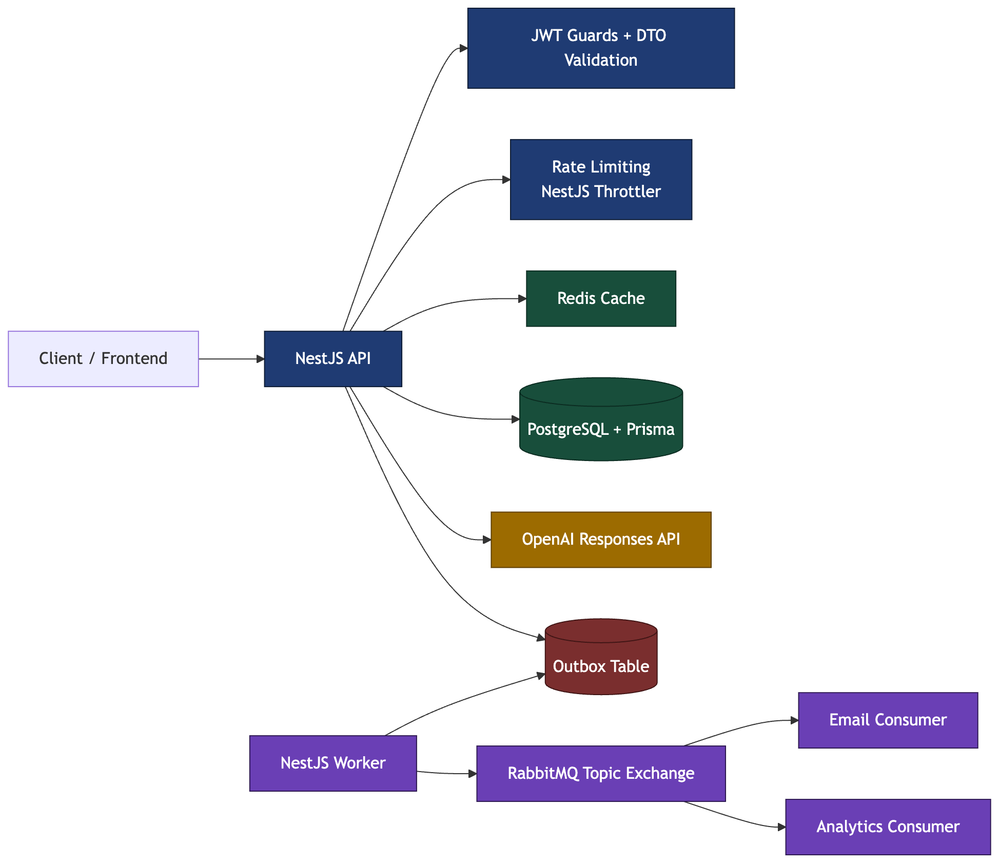
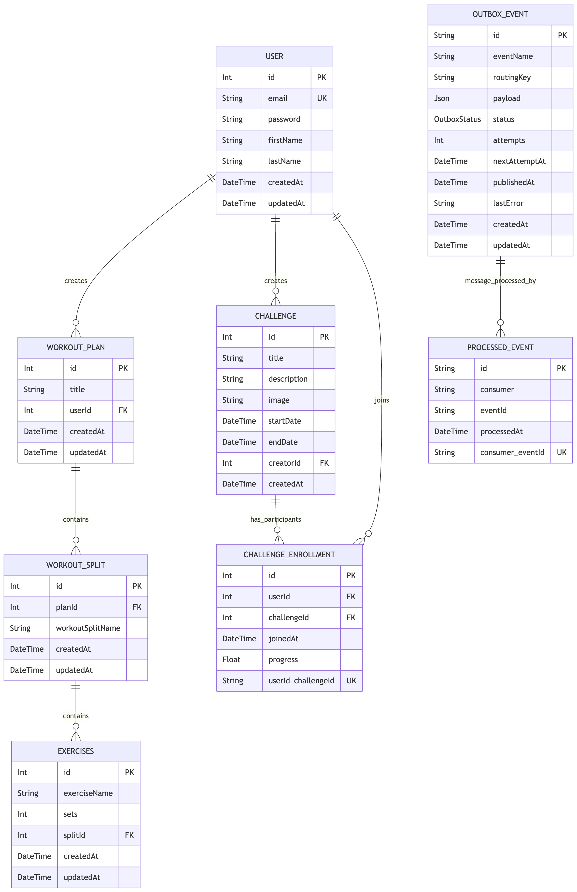
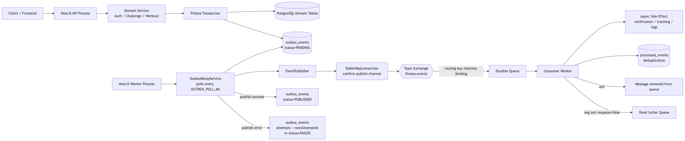

# Fitness Challenges & Workouts API

A production-style backend for managing users, fitness challenges, structured workout plans, and an AI fitness assistant. The stack is built around **NestJS**, **Prisma**, **PostgreSQL**, **Redis**, **RabbitMQ**, and **JWT-based authentication**.

## Problem Statement

I work out frequently and wanted to build a backend around a domain I genuinely use and understand. This project started as a fitness platform idea and evolved into a production-style backend where I could strengthen practical backend engineering skills across authentication, relational data modeling, caching, rate limiting, asynchronous messaging, and AI-assisted user workflows.

## Highlights

- **Modular NestJS API**: auth, users, workouts, challenges, chat, messaging, and worker modules.
- **Secure auth**: Passport-JWT, route guards, Bearer tokens, argon2 hashing, and DTO validation.
- **Prisma data model**: PostgreSQL relations for users, challenges, enrollments, workouts, and outbox events.
- **AI assistant**: OpenAI Responses API with tool calling over real workout and challenge data.
- **Performance layer**: Redis caching and NestJS rate limiting for faster, safer API access.
- **Async processing**: RabbitMQ, outbox pattern, worker process, retries, email, and analytics consumers.

## Architecture Overview

This project uses a **modular monolith + background worker architecture**. The main NestJS API handles authentication, validation, throttling, Redis-backed caching, Prisma/PostgreSQL data access, and AI chat orchestration through the OpenAI Responses API. For write operations, the API also stores domain events in an **outbox table** inside the same transaction, and a separate **worker process** publishes those events to RabbitMQ so downstream side effects like email delivery and analytics tracking run asynchronously without delaying the HTTP response.

### High-Level Flowchart



### System Request + Event Processing Architecture


### Module Responsibilities

- **Auth**: sign-up, sign-in, JWT issuance, password hashing, route protection
- **User**: profile retrieval and updates, user-specific challenge listings
- **Challenge**: challenge CRUD, join/leave flows, participation progress, active challenge reads, Redis-cached queries
- **Workout**: workout plan, split, and exercise CRUD with nested Prisma writes
- **Chat**: AI assistant orchestration with OpenAI tool calling over application data
- **Messaging**: RabbitMQ connection, event publishing, outbox persistence
- **Worker**: outbox relay, email consumer, analytics consumer, retry-safe async processing
- **Prisma**: centralized database access and schema-driven relational modeling

## Data Model (Prisma)

The relational model centers on the core fitness domain plus RabbitMQ reliability tables for asynchronous processing.



Core tables:

- `User`
- `Challenge`
- `ChallengeEnrollment`
- `WorkoutPlan`
- `WorkoutSplit`
- `Exercises`
- `OutboxEvent`
- `ProcessedEvent`

The outbox and processed-event tables support reliable asynchronous delivery and idempotent consumer behavior for RabbitMQ-backed workflows.

## AI Fitness Assistant

ChallengeFit includes an AI assistant that uses **OpenAI server-side** with **tool calling** to ground responses in real app data such as workout plans, workout splits/exercises, and challenge participation.

### How It Works

1. The client sends a chat request to the API with a valid JWT.
2. The model can request backend tools such as:
   - list the authenticated user's workout plans
   - fetch a workout plan by id
   - list challenges the user has joined
   - fetch active challenges
3. The backend executes those tool calls via existing services backed by Prisma and PostgreSQL.
4. The model uses that data to generate the final response.

> The model never queries the database directly. It only receives the tool outputs returned by the backend.

## Performance, Reliability, and Async Processing

### API Rate Limiting

- Global request throttling is enabled through **NestJS Throttler**
- Sensitive auth routes apply tighter limits to reduce brute-force and abuse attempts
- Rate limiting is enforced before expensive downstream work

### Redis Caching

- **Redis** is configured as the shared cache store via Nest's cache manager
- Read-heavy challenge endpoints use cache keys for:
  - single challenge lookups
  - paginated challenge listings
  - challenge participant listings
  - active challenge queries
- This reduces repeated Prisma/PostgreSQL reads and improves response latency

### RabbitMQ + Outbox Pattern

- Domain writes queue events into an **Outbox table** inside the same transaction as the main business update
- A separate **worker process** polls pending outbox events and publishes them to **RabbitMQ**
- Consumers handle async side effects such as:
  - email notifications
  - analytics/event tracking
- Retry logic, durable queues, and processed-event tracking improve delivery reliability and reduce duplicate handling


## Local Development

### Prerequisites

- Node.js 18+
- Docker / Docker Desktop
- npm
- OpenAI API key for the chat feature

### Environment

Create a `.env` file in the project root and configure:

- `DATABASE_URL`
- `JWT_SECRET`
- `OPENAI_API_KEY`
- `REDIS_HOST`
- `REDIS_PORT`
- `REDIS_TTL`
- `RABBITMQ_URL`
- `RABBITMQ_EXCHANGE`
- `RABBITMQ_PREFETCH`
- `OUTBOX_POLL_MS`
- `OUTBOX_BATCH_SIZE`
- `OUTBOX_MAX_RETRIES`
- `OUTBOX_RETRY_BASE_MS`
- `SMTP_HOST`
- `SMTP_PORT`
- `SMTP_USER`
- `SMTP_PASS`
- `MAIL_FROM`

### Start Infrastructure

```bash
docker compose up -d
```

This brings up:

- PostgreSQL
- Redis
- RabbitMQ with management UI

### Install and Prepare the Database

```bash
npm install
npx prisma generate
npx prisma migrate dev --name init
```

### Run the API

```bash
npm run start:dev
```

API default:

- `http://localhost:3000`

### Run the Worker

```bash
npm run start:worker:dev
```

RabbitMQ management UI:

- `http://localhost:15672`

## Security

- JWT bearer authentication for protected endpoints
- Password hashing with **argon2**
- DTO validation with Nest global validation pipe
- Route guards for user-scoped access control
- Request throttling to mitigate abusive traffic
- File uploads restricted through a custom interceptor and Multer limits

## Database and Migrations

- Generate Prisma client: `npx prisma generate`
- Create a development migration: `npx prisma migrate dev --name <name>`
- Apply migrations in production: `npx prisma migrate deploy`
- Inspect data locally: `npx prisma studio`

## Notes

- The API and worker run as separate NestJS processes inside the same repository
- Redis and RabbitMQ are infrastructure dependencies in local development and production
- The async messaging layer is designed to keep HTTP writes responsive while offloading notification and analytics side effects
